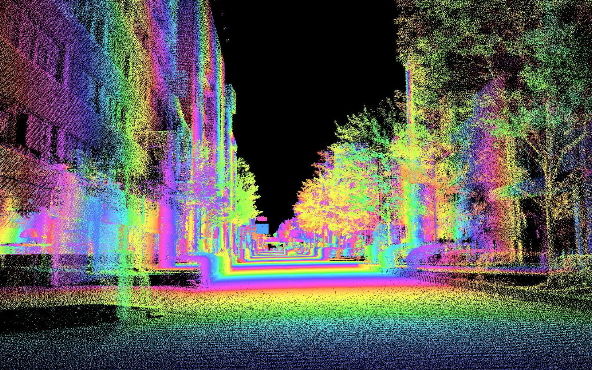
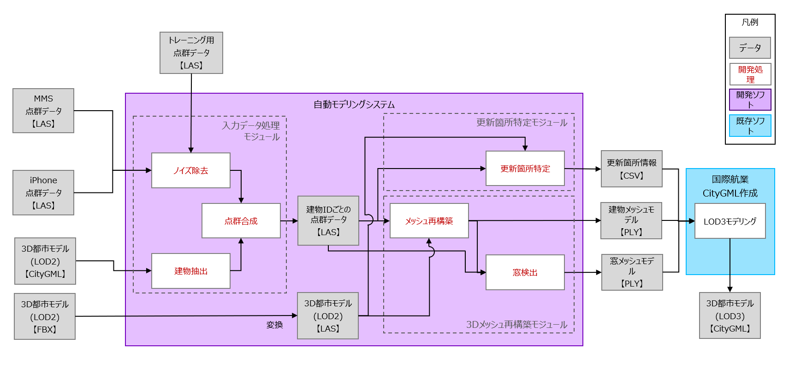
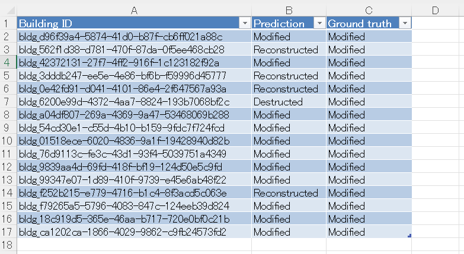

# FY2022 Project PLATEAU UC22-053「AIを用いた3D都市モデルの自動更新手法」の成果物（２）

## 1. 概要


公共交通のバスやタクシー等のモビリティに搭載されたLiDAR等で定常的に取得される点群データや、スマートフォン等で市民が日常的に取得できるデータを活用して、3D都市モデルのデータソースを取得。これに基づき点群合成・更新箇所検出を行うA.I.モデルを及び3D都市モデルを生成する自動モデリングツールの使用方法を記載したものです。  

## 2. モジュール構成
今回、実証開発した自動モデリングシステムは、大きく3つのモジュールからなり、6つのステップで処理を行ないます。



| モジュール | 処理ステップ | 対応スクリプト |
|:----------|:------------|:------------|
| A. 入力データ処理<br>（[別リポジトリ](https://github.com/Symmetry-Dimensions-Inc/LiDAR-data-processing-pipeline)） | (1) ノイズ除去<br>(2) 建物抽出<br><br>(3) 点群合成 | - <br>01_create_footprint_polygons.py<br>02_polygon_expansion.py<br>04_split_dataset_points_to_buildings_with_realignment.py |
| B. 変更箇所特定 | (4) 変更箇所特定 | pointcloud_similarity.py |
| C. 3Dメッシュ再構築<br>（[別リポジトリ](https://github.com/Symmetry-Dimensions-Inc/LiDAR-data-processing-pipeline)） | (5) メッシュ再構築<br><br>(6) 窓検出 | 05_combine_lod2_and_point_cloud.py<br>06_run_iPSR.py<br>05_combine_lod2_and_point_cloud.py |

本リポジトリは「B. 変更箇所特定モジュール」を含んでおり、「A. 入力データ処理モジュール」と「C. 3Dメッシュ再構築モジュール」は、[別リポジトリ](https://github.com/Symmetry-Dimensions-Inc/LiDAR-data-processing-pipeline)にて公開しています。

## 3. 利用手順

### 動作環境
本プログラムは Linux にインストールされた Python 3.8 で動作確認を行なっています。他のプラットフォームや Python のバージョンで動作させるには、ソースコードや設定ファイルの修正が必要になることがあります。

### DCPCRのインストール
まず、以下のコマンドを実行し、DCPCRをインストールします。
```sh
pip3 install -e .
```

学習済みのDCPCRモデルを[ここ](https://www.ipb.uni-bonn.de/html/projects/dcpcr/model_paper.ckpt) からダウンロードし、ルートフォルダに保存します。

### その他の前提ライブラリのインストール
次に、以下のコマンドを実行し、その他の Python の前提ライブラリをインストールします。
```sh
pip3 install -r requirements.txt
```

### データの準備

[ここ](https://plateau-uc22-0053-data.s3.ap-northeast-1.amazonaws.com/20230207_building_changes_detection_data.zip)から、サンプルデータを取得してください。

zip ファイルを解凍すると、2つのフォルダが現れます。
* `LOD2`: LOD2モデルから変換した点群データ(target).
* `Newpcd`: LiDARで取得した点群データ(source).

それぞれのフォルダは `BLUE` / `GREEN` / `RED` / `YELLOW` のサブフォルダを含み、正解（Ground truth）の異動クラスを与えます。
* `BLUE`: **増改築（Modified）** された建物
* `GREEN`: **滅失後新築（Reconstructed）** された建物
* `RED`: **滅失（Destructed）** した建物
* `YELLOW`: **新築（Newly Constructed）** された建物

※ 新築された建物のLOD2モデルは存在しないため、LOD2フォルダにYELLOWは含まれません。


### 設定ファイルの編集

`pointcloud_similarity.yaml` 内の各パラメータを編集します。
| パラメータ    | 説明                         |
|:-------------|:-----------------------------|
| checkpoint   | 学習済みDCPCRモデルファイル (.ckpt) のパス |
| lod2_path    | LOD2モデルから変換した点群データが格納されているパス |
| pcd_path     | LiDARで取得した点群データが格納されているパス |

### スクリプトの実行
以下のようにクリプトを実行します。
```
python pointcloud_similarity.py [オプション]
```

スクリプトは以下のオプションを指定することができます。
* `-c`：設定ファイルへのパス （デフォルト： `pointcloud_similarity.yaml`）
* `-ft`：GICPでの微調整 （デフォルト：True）
* `-vs`：ダウンサンプリングのためのボクセルサイズ （デフォルト：0.03）
* `-sr`：2つの建物の類似性を定義する比率 （デフォルト：50）
* `-t`：建物が破壊されたとみなされる1スキャンあたりの最小ポイント数 （デフォルト：20）
* `-b`：テスト対象のデータを Green / Blue / Red / Yellow から指定 （デフォルト：Blue）

### 出力ファイル仕様

`pointcloud_similarity.py` スクリプトは、スクリプトを実行した時のフォルダに Excel ファイルを出力します。
出力ファイルは以下の項目を含みます。
| カラム       | 説明  |
|:------------|:------|
| Building ID | 建物ID |
| Prediction  | 推定された異動クラス<br>  ・ Modified: 増改築<br> ・ Reconstructed: 滅失後新築<br> ・ Destructed: 滅失<br> ・ Newly Constructed: 新築 |
| Ground truth | 正解の異動クラス |



## 4. ライセンス
* 本ドキュメントは[Project PLATEAUのサイトポリシー](https://www.mlit.go.jp/plateau/site-policy/)（CCBY4.0および政府標準利用規約2.0）に従い提供されています。

## 5. 注意事項
* 本レポジトリは参考資料として提供しているものです。動作保証は行っておりません。
* 予告なく変更・削除する可能性があります。
* 本レポジトリの利用により生じた損失及び損害等について、国土交通省はいかなる責任も負わないものとします。

## 6. 参考資料
* 技術検証レポート: https://www.mlit.go.jp/plateau/file/libraries/doc/plateau_tech_doc_0053_ver01.pdf

