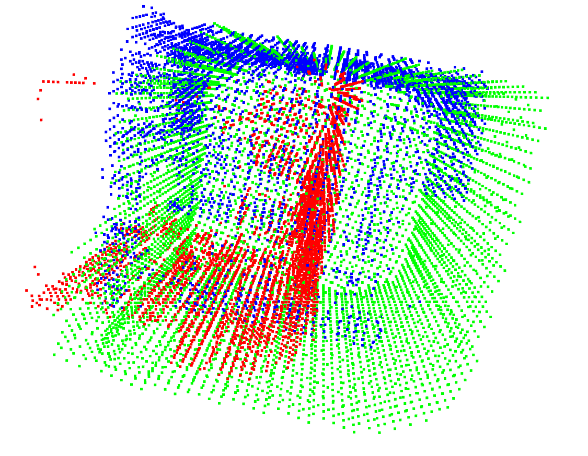

# Point Cloud Similarity documentation
The goal of this work is to report similarities between a source and a target pointcloud of a building with high accuracy. Using this building similarity we aim to be able to classify the {Source, Target} set into one of these 4 categories:
1. Modified
2. Reconstructed
3. Newly constructed
4. Destructed

To do that, we will be using `pointcloud_similarity.py`. In this document we will be explaining the details about our script.

## How it works
Steps:
1. The scipts takes as input a set of source (scans) and target LOD2 pointclouds.
2. For each {Source, Target} we perform a preprocessing phase which includes: normalization and subsampling using voxelization.
3. For each {Source, Target} we perform parallarily GICP and [DCPCR](https://drive.google.com/file/d/1ka5awEEzqkGs9xQQ6SJW3ZFWdNAWJyWu/view) + GICP combined together.
4. For each technique mentioned in step 3, we allign the source to target and we calculate the similarity. The similarity is the ratio (%) of points from the source that are within a threshold euclidean distance from points from the target pointcloud.
5. We get the transformation matrix that results in higher similarity between the two techniques in step 3
6. We classify the {Source, Target} set accordingly:
    * If the LOD2 doesn't exist = Category 3: Building is newly constructed
    * If the source scan is empty (or too sparse) = Category 4: Building destructed
    * If similarity ratio between source and target is above 50% = Category 1: Building modified
    * If similarity ratio between source and target is below 50% = Category 2: Building reconstructed

## How to run
The user has full control on the how to run the scripts using flags:
* `-ckpt`: path to checkpoint file (.ckpt) to resume training (default='model_paper.ckpt')
* `-ft`: Whether to fine tune the dcpcr results with icp or not. (default=True)
* `-vs`: voxel size for pointcloud downsampling. (default=0.03)
* `-sr`: % ratio threshold to define the similarity between two buildings. (default=50)
* `-t`: minimun number of points per scan under which the building is considerated as destructed. (default=20)
* `-b`: Define the ground truth green, blue, red or yellow. (default='blue')
* `vis`: Whether to visualize the aligned pointcloud. (default=False)

To run the script, please copy the command bellow:
```
python pointcloud_similarity.py -ckpt [path_to_checkpoint] [optional: add other flags]
```

## Results
We report results on our sendai private data. The source data represent scans taken for the building while the target is the pointcloud generated from LOD2. Data can be found [here](https://drive.google.com/drive/folders/1bphqSdg1_73WYpi0Pr1dDfn5TJdzIjM8).

Results
| Ground truth/Prediction | Modified       | Reconstructed       | Destructed      | Newly constructed       | Accuracy       |
|----------|-------------|-------------|-------------|-------------|-------------|
| Modified (16 scan)  | 11        | 4    | 1       | 0 | 68.75% |
| Reconstructed (39 scan) | 0         | 36     | 3         | 0 | 92.3% |
| Destructed  (65 scan) | 4       | 54   | 7        | 0 | 10.8% |
| Newly constructed (30 scan) | 0       | 0    | 0       | 30 | 100% |

## Visualization
We can visualize the source to target alignment by setting `vis` flag to `True`. Visualization are done using open3d.
* Green points: target building pointcloud
* Red points: source captured scan
* Blue points: aligned source scan with the target building

Below is an example of a captured scan of a modified building (category 1)
